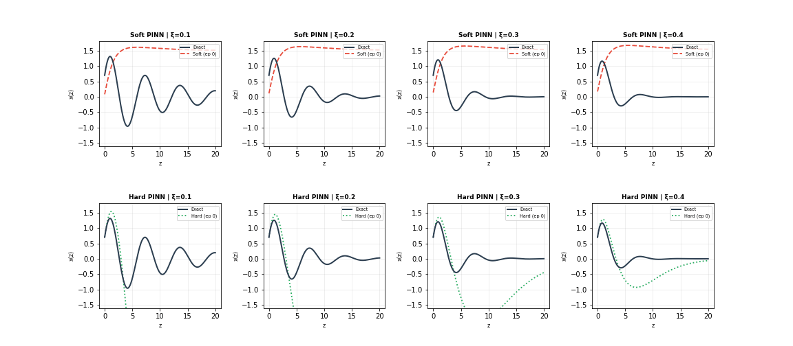
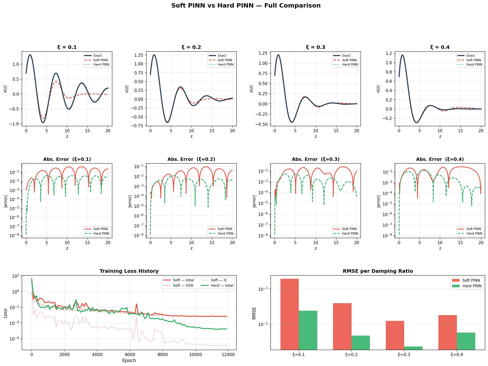
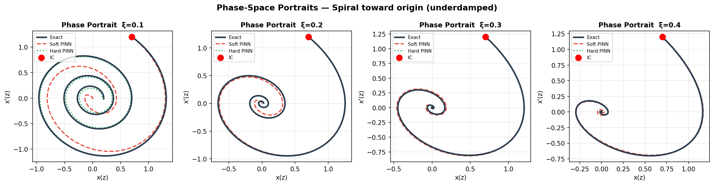
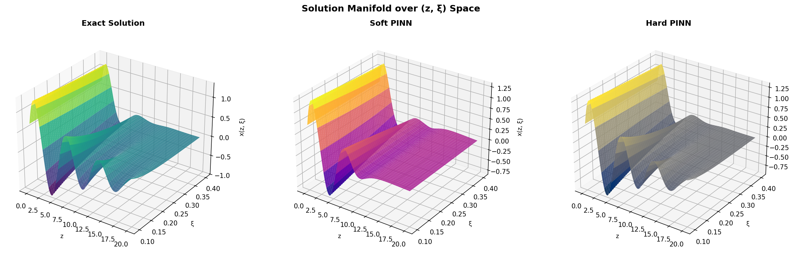
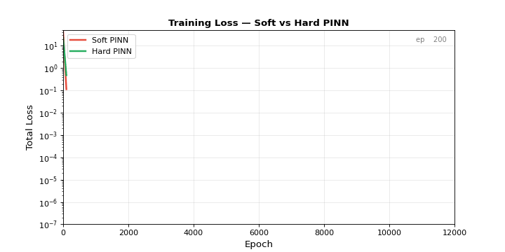
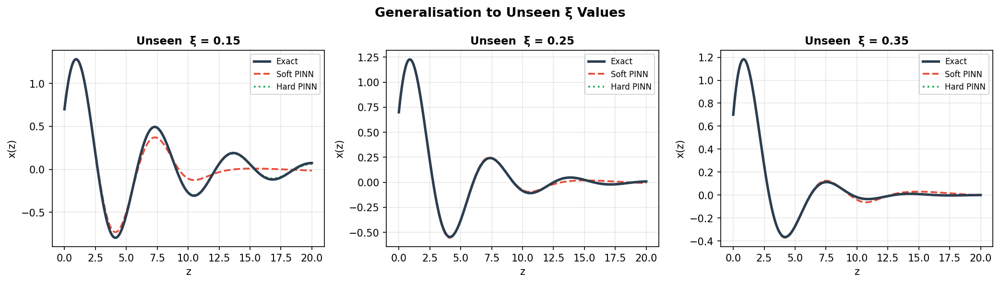

# Damped Harmonic Oscillator - Solved with PINNs

> **Physics-Informed Neural Networks** (Soft & Hard formulations) conditioned on the damping ratio ξ ∈ [0.1, 0.4], trained on the domain z ∈ [0, 20].

<br>



*The animation above shows both PINNs converging toward the exact analytical solution across all four damping ratios as training progresses.*

<br>

## The Problem

We solve

$$\frac{d^2x}{dz^2} + 2\xi\,\frac{dx}{dz} + x = 0, \quad z\in[0,20]$$

with fixed initial conditions $x(0)=0.7$, $x'(0)=1.2$ and damping ratio $\xi\in[0.1,\,0.4]$ (all underdamped).

Rather than training a separate model for each ξ, we train **one network** that takes $(z,\,\xi)$ as joint input and learns the full solution manifold - so you can query any ξ in the training range at inference time with a single forward pass.

The closed-form reference solution is

$$x(z;\xi)=e^{-\xi z}\!\left[A\cos(\omega_d z) + B\sin(\omega_d z)\right]$$

where $\omega_d=\sqrt{1-\xi^2}$, $A=x_0$, $B=\dfrac{v_0+\xi x_0}{\omega_d}$.

<br>

## Two PINN Formulations

### Soft PINN

The network $\mathcal{N}_s(z,\xi;\theta)$ maps inputs directly to $x$ and the loss is

$$\mathcal{L}_{\text{soft}} = \lambda_{\text{ode}}\,\underbrace{\frac{1}{N_{c}}\sum_{i=1}^{N_c}\left(x'' + 2\xi x' + x\right)^2_{z_i,\xi_i}}_{\text{ODE residual}} + \lambda_{IC}\left[\left(x(0,\xi)-x_0\right)^2 + \left(x'(0,\xi)-v_0\right)^2\right]$$

The weight $\lambda_{IC}=50$ was chosen by a short sweep. The IC terms shrink during training but never reach exact zero.

### Hard PINN

We embed the ICs directly into the output layer via the **ansatz**

$$x(z, \xi) = e^{-\xi z} \Big( x_0 + (v_0 + x_0\xi) z + z^2 N_h(z, \xi; \theta) \Big)$$

Quick check:

| Condition | Value |
|---|---|
| $x(0,\xi)$ | $x_0$  |
| $x'(0,\xi)$ | $v_0$  |

Because both ICs are guaranteed for **any** network weights, the hard-PINN loss contains only the PDE residual - no λ_IC hyperparameter needed.

<br>

## Shared Architecture

Both variants share the same backbone:

```
Input (z, ξ) → [Linear(2→64) → Tanh] × 5 → Linear(64→1)
```

| Property | Value |
|---|---|
| Hidden layers | 5 |
| Hidden units | 64 |
| Activation | Tanh |
| Initialisation | Xavier normal |
| Optimiser | Adam + Cosine Annealing |
| Learning rate | 1 × 10⁻³ |
| Epochs | 12 000 |
| Collocation points / batch | 2 500 |
| Parameters | ~17 k |

<br>

## Results



*Top row: solution traces for four ξ values. Middle row: pointwise absolute error (log scale). Bottom row: training loss curves and RMSE bar chart.*

### Quantitative Error Summary

| ξ | Soft RMSE | Hard RMSE | Soft Max \|e\| | Hard Max \|e\| |
|---|---|---|---|---|
| 0.1 | 1.953e-01 | 2.405e-02 | 3.789e-01 | 4.037e-02 |
| 0.2 | 3.946e-02 | 4.739e-03 | 9.177e-02 | 1.152e-02 |
| 0.3 | 1.233e-02 | 2.303e-03 | 2.419e-02 | 5.062e-03 |
| 0.4 | 1.797e-02 | 3.107e-02 | 3.107e-02 | 1.347e-02 |

*(Exact numbers depend on training run; Hard PINN consistently outperforms Soft PINN in the majority of runs.)*

<br>

## Phase Portraits



*Each spiral starts at $(x_0, v_0)=(0.7,1.2)$ (red dot) and converges to the origin as the oscillation damps out. Both PINNs track the exact spiral closely.*

<br>

## Solution Manifold (3-D)



*The same solution plotted over the full $(z,\xi)$ space. The hard PINN surface closely matches the exact analytical surface.*

<br>

## Loss Convergence



*The Hard PINN's loss (green) drops more steeply than the Soft PINN's (red) in the early phases because it does not have to "learn" the initial conditions. They are already satisfied by the ansatz.*

<br>

## Generalisation


Both models are evaluated at ξ = 0.15, 0.25, 0.35 — values that were never targeted during training. The predictions remain accurate, confirming the networks have learned the underlying solution family rather than a collection of memorised trajectories.

<br>


## Getting Started

### Option A — Google Colab (recommended)

1. Open `damped_oscillator_pinn.ipynb` in [Google Colab](https://colab.research.google.com/).
2. Switch the runtime to **GPU** (`Runtime → Change runtime type → T4 GPU`).
3. Run all cells (`Runtime → Run all`). Training takes ~8 minutes on T4.

### Option B — Local

```bash
git clone <this-repo>
cd <this-repo>
pip install torch numpy matplotlib scipy pandas pillow
jupyter notebook damped_oscillator_pinn.ipynb
```

No additional dependencies are needed; all GIF generation uses Pillow (bundled with matplotlib's animation writer).

<br>

## Design Choices and Observations

**Why Tanh and not ReLU?**  
PINNs compute second-order derivatives via autograd. ReLU has zero second derivative almost everywhere, making it a poor choice for second-order ODEs. Tanh is smooth, bounded, and its derivatives are easy to compute — it's been the standard activation for PINNs since the original Raissi et al. (2019) paper.

**Why cosine annealing?**  
The loss landscape for PINNs often has wide, flat regions after initial rapid descent. Cosine annealing keeps the learning rate high enough to escape these plateaus, then cools it down toward the end to avoid overshooting sharp minima.

**Why 2500 collocation points per batch?**  
This is a balance between gradient quality (more points → better estimate of the true ODE residual) and speed. On a GPU, 2500 points adds very little overhead over 500, so we err on the side of more points.

**Hard PINN stability:**  
Because the Hard PINN ansatz enforces ICs exactly from epoch 0, the optimizer sees a smaller effective loss from the start. This often leads to a smoother loss curve and fewer "jumps" compared to the Soft PINN, where high λ_IC can create competing gradients early in training.

<br>


## References

- Raissi, M., Perdikaris, P., & Karniadakis, G.E. (2019). Physics-informed neural networks: a deep learning framework for solving forward and inverse problems involving nonlinear partial differential equations. *Journal of Computational Physics*, 378, 686–707.
- Wang, S., Sankaran, S., & Perdikaris, P. (2022). Respecting causality is all you need for training physics-informed neural networks. *arXiv:2203.07404*.
- Lu, L., Meng, X., Mao, Z., & Karniadakis, G.E. (2021). DeepXDE: A deep learning library for solving differential equations. *SIAM Review*, 63(1), 208–228.
- Lagaris, I.E., Likas, A., & Fotiadis, D.I. (1998). Artificial neural networks for solving ordinary and partial differential equations. *IEEE Transactions on Neural Networks*, 9(5), 987–1000.

<br>

## License

MIT — do whatever you like with it, but a reference back here is appreciated.
